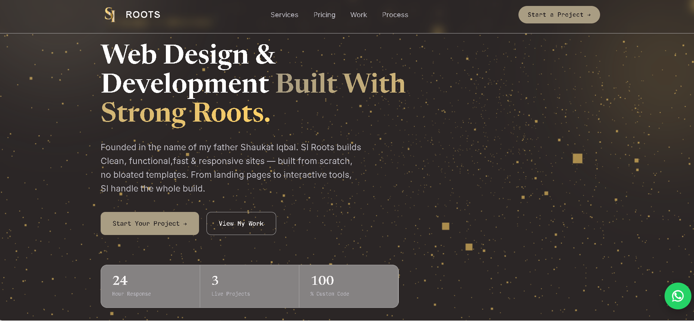

<div style="text-align: center;">
  
</div>

# SI ROOTS — Web Design & Development Portfolio

A personal portfolio and web development studio site — built to showcase real, working projects for Swiss & Dutch businesses.

**[🚀 Live Site](https://ikhansa623-source.github.io/SI-ROOTS-Portfolio/)** 



## Overview

**SI ROOTS** is my portfolio and freelance web development studio — founded in the name of my father, Shaukat Iqbal. 

We build fast, responsive websites and AI-powered web apps that help small businesses grow online. This site showcases my work, services, and a direct way for potential clients to get in touch.

## ✨ Key Features

- **Custom Landing Page**: Hero, Services, Pricing, Portfolio, Process, and Contact sections
- **Smooth Animations**: Scroll-reveal effects and interactive hover animations
- **Lead Generation**: Working contact form via Formspree + Floating WhatsApp button
- **100% Responsive**: Perfect on mobile, tablet, and desktop
- **Real Projects Only**: All portfolio links go to live, working websites

## 🛠️ Tech Stack

- **Frontend**: HTML5, CSS3, JavaScript ES6+
- **Animations**: IntersectionObserver API, Custom CSS Animations
- **Forms**: Formspree for backend contact form handling
- **Deployment**: GitHub Pages + Git Workflow

## 📂 Featured Projects
1. [Rooh ka Sukoon — Quran Player](https://ikhansa623-source.github.io/Rooh-ka-Sukoon--Quran/)- Audio player with playlist & reciter        selection
2. [Memory Matching Game]( https://ikhansa623-source.github.io/memory-matching-game/) - Interactive JS game with score tracking
3. [Pet Age Calculator](https://ikhansa623-source.github.io/Pet-Age-Calculator/) - Responsive tool to convert pet age to human years


## 📈 What I Learned

This project taught me the full deployment workflow:
- Git & GitHub version control and resolving merge conflicts
- Deploying static sites with GitHub Pages
- Integrating 3rd party services like Formspree without a custom backend
- Building for performance and mobile-first design

## 📂 Folder Structure

```
├── index.html
├── script.js
├── style.css
├── logo.png
├── favicon.png
└── screenshot/
    └── hero-sec.png
```


## 🚀 Running Locally

1. Clone this repository
   ```bash
   git clone https://github.com/ikhansa623-source/SI-ROOTS-Portfolio
   Or [Download ZIP](https://github.com/ikhansa623-source/SI-ROOTS-Portfolio/archive/refs/heads/main.zip)